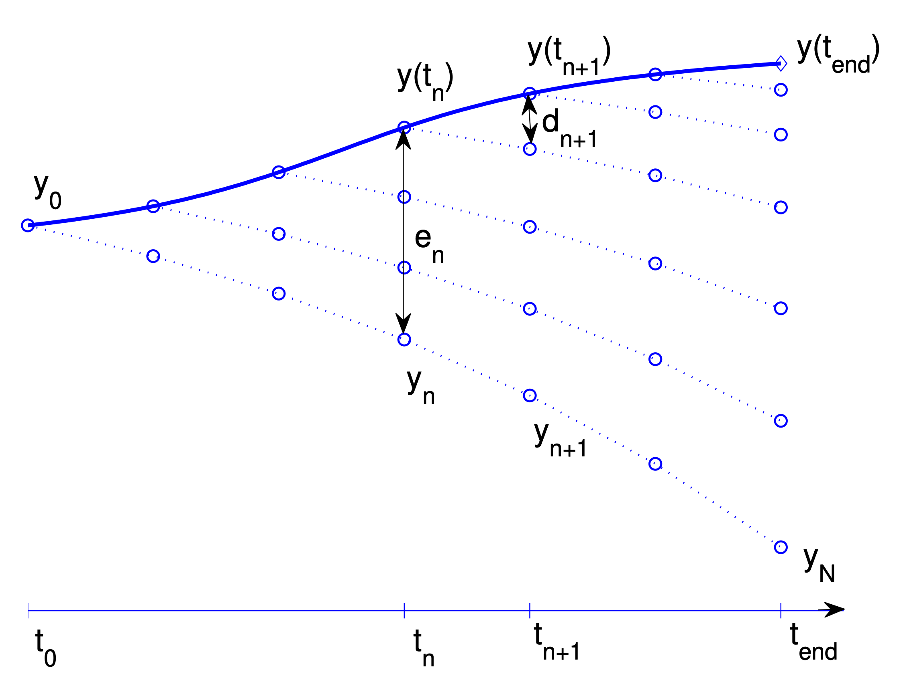

---
jupytext:
  formats: ipynb,md:myst
  text_representation:
    extension: .md
    format_name: myst
    format_version: 0.13
    jupytext_version: 1.16.6
kernelspec:
  display_name: Python 3 (ipykernel)
  language: python
  name: python3
---

+++ {"slideshow": {"slide_type": "slide"}, "editable": true}

## Numerical solution of ordinary differential equations: Error analysis of one step methods

+++ {"slideshow": {"slide_type": "slide"}, "editable": true}

As always, we start by importing the necessary modules:

```{code-cell} ipython3
---
editable: true
slideshow:
  slide_type: slide
tags: [thebe-init, hide-input]
---
import numpy as np
from numpy import pi
from numpy.linalg import solve, norm    
import matplotlib.pyplot as plt

# Do a pretty print of the tables using panda
import pandas as pd
from IPython.display import display

# If you want to use a funny plotting style, uncomment the following line 
# plt.xkcd()
newparams = {'figure.figsize': (6.0, 6.0), 'axes.grid': True,
             'lines.markersize': 8, 'lines.linewidth': 2,
             'font.size': 14}
plt.rcParams.update(newparams)
```

+++ {"slideshow": {"slide_type": "slide"}, "editable": true}

### One Step Methods

In the previous lecture, we introduced the explicit Euler method and
Heun's method. Both methods require only the function $f$, the step
size $\tau_k$, and the solution $y_k$ at the *current* point $t_k$,
without needing information from earlier points $t_{k-1}, t_{k-2},
\ldots$. This motivates the following definition.

+++ {"slideshow": {"slide_type": "slide"}, "editable": true}

:::{prf:definition} One step methods
:label: ode:def:one-step-meth

A one step method (OSM) defines an approximation to the IVP
in the form of a discrete function
$
{\boldsymbol y}_{\Delta}:
\{
t_0, \ldots, t_N
\} \to \mathbb{R}^n
$
given by

$$
{\boldsymbol y}_{k+1}
:=
{\boldsymbol y}_k
+
\tau_k
\Phi(t_k,
{\boldsymbol y}_{k},
{\boldsymbol y}_{k+1},
\tau_{k})
$$(ode:eq:osm-def)

for some **increment function**

$$
\Phi: [t_0,T] \times \mathbb{R}^n \times \mathbb{R}^n \times \mathbb{R}^+ \to \mathbb{R}^n.
$$

:::

+++ {"slideshow": {"slide_type": "fragment"}, "editable": true}

The OSM is called **explicit** if the increment function $\Phi$
does not depend on ${\boldsymbol y}_{k+1}$, otherwise it is called **implicit**.

+++ {"slideshow": {"slide_type": "slide"}, "editable": true}

:::{prf:example} Increment functions for Euler and Heun
:label: ode:exa:increment_function_euler_heun

The increment functions for Euler's and Heun's methods are defined as
follows:

$$
\Phi(t_k,
y_{k},
y_{k+1},
\tau_{k})
=
f(t_k, y_k),
\qquad
\Phi(t_k,
y_{k},
y_{k+1},
\tau_{k})
=
\tfrac{1}{2}
\left(
f(t_{k}, y_k)
+
f\bigl(t_{k+1}, y_{k}+\tau_k f(t_k, y_k)
\bigr)
\right).
$$

:::

+++ {"slideshow": {"slide_type": "slide"}, "editable": true}

### Local and global truncation error of OSM

+++ {"slideshow": {"slide_type": "slide"}, "editable": true}

:::{prf:definition} Local truncation error
:label: ode:def:consist_err

The **local truncation error** $\eta(t, \tau)$ is defined by

$$
\eta(t, \tau) = y(t) + \tau \Phi(t, y(t), y(t+\tau), \tau) - y(t+\tau).
$$(ode:eq:consist_err)

$\eta(t, \tau)$ is often also called the **local discretization** or **consistency error**.

A one step method is called **consistent of order $p\in \mathbb{N}$** if
there is a constant $C > 0$ such that

$$
|\eta(t, \tau) | \leqslant C \tau^{p+1} \quad \text{for } \tau \to 0.
$$

A short-hand notation for this is to write
$
\eta(t, \tau) = \mathcal{O}(\tau^{p+1})$ for $\tau \to 0.
$

:::

+++ {"slideshow": {"slide_type": "slide"}, "editable": true}

:::{prf:example} Consistency order of Euler's method
Euler's method has consistency order $p=1$.
:::

+++ {"slideshow": {"slide_type": "slide"}, "editable": true}

:::{prf:definition} Global truncation error
:label: ode:def:global_err

For a numerical solution
$
y_{\Delta}:
\{
t_0, \ldots, t_N
\} \to \mathbb{R}
$
the **global truncation error** is defined by

$$
e_k(t_{k-1}, \tau_{k-1}) = y(t_{k}) - y_{k}
\quad \text{for } k=1,\ldots,N.
$$(:label: ode:eq:global_err)

A one step method is called **convergent with order $p\in\mathbb{N}$** if

$$
\max_{k \in \{1,\ldots,N\}}
|e_k(t_{k-1},\tau_{k-1})|
= \mathcal{O}(\tau^p)
$$(ode:eq:global_err_conv)

with $\tau = \max_k \tau_k$.

:::

+++ {"editable": true, "slideshow": {"slide_type": "slide"}}

<!-- :::{figure} ./LadyWindermereFan.png
---
height: 500px
name: LadyWinderemerFan
---

Lady Windermere’s fan, named after a comedy play by Oscar Wilde. The
figure describes the transport and the accumulation of the local truncation errors
$\eta(t_n,\tau_n) =: d_{n+1}$  into the global error $e_N = y(t_N)-y_N$ at the end point $ t_N = t_{\mathrm{end}}$.

::: -->



**Figure.** Lady Windermere’s fan, named after a comedy play by Oscar Wilde. The
figure describes the transport and the accumulation of the local truncation errors
$\eta(t_n,\tau_n) =: d_{n+1}$  into the global error $e_N = y(t_N)-y_N$ at the end point $ t_N = t_{\mathrm{end}}$.

+++ {"slideshow": {"slide_type": "slide"}, "editable": true}

**Discussion.**

If a one step method has convergence order equal to $p$, the maximum
error
$e(\tau) = \max_k{|e(t_k, \tau)|}$
can be thought as a function of the step size $\tau$ is of the form

$$
e(\tau) = O(\tau^p) \leqslant C \tau^p.
$$

+++ {"slideshow": {"slide_type": "fragment"}, "editable": true}

This implies that if we change the time step size
from $\tau$ to e.g. $\tfrac{\tau}{2}$,
we can expect that the
error decreases from $C \tau^p$
to $C (\tfrac{\tau}{2})^p$, that is, the error
will be reduced by a factor $2^{-p}$.

+++ {"slideshow": {"slide_type": "slide"}, "editable": true}

How can we determine the convergence rate by means of numerical
experiments?

+++ {"slideshow": {"slide_type": "fragment"}, "editable": true}

Starting from
$
e(\tau) = O(\tau^p) \leqslant C \tau^p
$
and taking the logarithm gives

$$
\log(e(\tau)) \leqslant p \log(\tau) + \log(C).
$$

Thus $\log(e(\tau))$ is a linear function of $\log(\tau)$ and the slope
of this linear function corresponds to the order of convergence $p$.

+++ {"slideshow": {"slide_type": "fragment"}, "editable": true}

So if you have an *exact solution* at your disposal, you can for an
increasing sequence `Nmax_list` defining a descreasing sequence of
*maximum* time-steps $\{\tau_0,
\ldots, \tau_N\}$
and solve your problem numerically and then compute the resulting exact error
$e(\tau_i)$ and plot it against $\tau_i$ in a $\log-\log$ plot to determine
the convergence order.

+++ {"slideshow": {"slide_type": "slide"}, "editable": true}

In addition you can also compute the
experimentally observed convergence rate
EOC for $i=1,\ldots M$ defined by

$$
\mathrm{EOC}(i) =
\dfrac{
\log(e(\tau_{i})) - \log(e(\tau_{i-1}))
}{
\log(\tau_{i}) - \log(\tau_{i-1})
}
=
\dfrac{
\log(e(\tau_{i})/e(\tau_{i-1}))
}{
\log(\tau_{i}/\tau_{i-1})
}
$$

Ideally, $\mathrm{EOC}(i)$ is close to $p$.

+++ {"slideshow": {"slide_type": "slide"}, "editable": true}

This is implemented in the following `compute_eoc` function.

```{code-cell} ipython3
---
editable: true
slideshow:
  slide_type: fragment
---
def compute_eoc(y0, t0, T, f, Nmax_list, solver, y_ex):
    errs = [ ]
    for Nmax in Nmax_list:
        ts, ys = solver(y0, t0, T, f, Nmax)
        ys_ex = y_ex(ts)
        errs.append(np.abs(ys - ys_ex).max())
        print("For Nmax = {:3}, max ||y(t_i) - y_i||= {:.3e}".format(Nmax,errs[-1]))

    errs = np.array(errs)
    Nmax_list = np.array(Nmax_list)
    dts = (T-t0)/Nmax_list

    eocs = np.log(errs[1:]/errs[:-1])/np.log(dts[1:]/dts[:-1])

    # Insert inf at beginning of eoc such that errs and eoc have same length 
    eocs = np.insert(eocs, 0, np.inf)

    return errs, eocs
```

+++ {"editable": true, "slideshow": {"slide_type": "slide"}}

Here, `solver` is any ODE solver wrapped into a Python function which can be called like this

```python
ts, ys = solver(y0, t0, T, f, Nmax)
```

+++ {"slideshow": {"slide_type": "slide"}, "editable": true}

:::{exercise}
:label: ode:exe:euler-conv-order
Use the `compute_eoc` function and
any of the examples with a known analytical solution from the previous lecture
to determine convergence order for Euler's.

Start from importing the Eulers's method from the previous lecture,
:::

```{code-cell} ipython3
---
editable: true
slideshow:
  slide_type: slide
---
def explicit_euler(y0, t0, T, f, Nmax):
    ys = [y0]
    ts = [t0]
    dt = (T - t0)/Nmax
    while(ts[-1] < T):
        t, y = ts[-1], ys[-1]  
        ys.append(y + dt*f(t, y))
        ts.append(t + dt)
    return (np.array(ts), np.array(ys))
```

+++ {"editable": true, "slideshow": {"slide_type": "slide"}}

and copy and complete the following code snippet to compute the EOC for the explicit Euler method:

```{code-block} python
# Data for the ODE
# Start/stop time
t0, T = ...
# Initial value
y0 = ...
# growth/decay rate
lam = ...

# rhs of IVP
f = lambda t,y: ...

# Exact solution to compare against 
# Use numpy version of exo, namely np.exp 
y_ex = lambda t: ...

# List of Nmax for which you want to run the study
Nmax_list = [... ]

# Run convergence test for the solver
errs, eocs = compute_eoc(...)
print(eocs)

# Plot rates in a table
table = pd.DataFrame({'Error': errs, 'EOC' : eocs})
display(table)
print(table)
```

```{code-cell} ipython3
---
editable: true
slideshow:
  slide_type: slide
---
# Insert code here.
```

+++ {"slideshow": {"slide_type": "slide"}, "editable": true}

**Solution.**

```{code-cell} ipython3
---
editable: true
slideshow:
  slide_type: fragment
---
t0, T = 0, 1
y0 = 1
lam = 1

# rhs of IVP
f = lambda t,y: lam*y

# Exact solution to compare against
y_ex = lambda t: y0*np.exp(lam*(t-t0))

Nmax_list = [4, 8, 16, 32, 64, 128, 256, 512]

errs, eocs = compute_eoc(y0, t0, T, f, Nmax_list, explicit_euler, y_ex)
print(eocs)

table = pd.DataFrame({'Error': errs, 'EOC' : eocs})
display(table)
print(table)
```

+++ {"slideshow": {"slide_type": "slide"}, "editable": true}

:::{exercise}
:label: ode:exe:heun-conv-order
Redo the previous exercise with Heun's method.

Start from importing the Heun's method from yesterday's lecture.
:::

```{code-cell} ipython3
---
editable: true
slideshow:
  slide_type: fragment
---
def heun(y0, t0, T, f, Nmax):
    ys = [y0]
    ts = [t0]
    dt = (T - t0)/Nmax
    while(ts[-1] < T):
        t, y = ts[-1], ys[-1]
        k1 = f(t,y)
        k2 = f(t+dt, y+dt*k1)
        ys.append(y + 0.5*dt*(k1+k2))
        ts.append(t + dt)
    return (np.array(ts), np.array(ys))
```

```{code-cell} ipython3
---
editable: true
slideshow:
  slide_type: slide
---
# Insert code here.
```

+++ {"slideshow": {"slide_type": "slide"}, "editable": true}

**Solution.**

```{code-cell} ipython3
---
editable: true
slideshow:
  slide_type: fragment
---
solver = heun
errs, eocs = compute_eoc(y0, t0, T, f, Nmax_list, solver, y_ex)
print(eocs)

table = pd.DataFrame({'Error': errs, 'EOC' : eocs})
display(table)
print(table)
```

+++ {"slideshow": {"slide_type": "slide"}, "editable": true}

### A general convergence result for one step methods


:::{note}

In the following discussion, we consider only **explicit** methods where the increment function
${\boldsymbol \Phi}$ 
**does not** depend on ${\boldsymbol y}_{k+1}$.

:::

+++ {"slideshow": {"slide_type": "slide"}, "editable": true}

:::{prf:theorem} Convergence of one-step methods
:label: ode:thm:osm-convergence-theory


Assume that there exist positive constants $M$ and $D$ such that the
increment function satisfies

$$
\| {\boldsymbol \Phi}(t,\mathbf{y};\tau) - {\boldsymbol \Phi}(t,\mathbf{z};\tau) \| \leq M \| \mathbf{y}-\mathbf{z} \|
$$

and
the local trunctation error satisfies

$$
\| {\boldsymbol \eta}(t, \tau) \| =
\| \mathbf{y}(t+\tau) - \left (\mathbf{y}(t) + \tau {\boldsymbol \Phi}(t, \mathbf{y}(t),
\tau)\right) \|
\leqslant D \tau^{p+1}
$$

for all $t$, $\mathbf{y}$ and $\mathbf{z}$ in the neighbourhood of the
solution.

In that case, the global error satisfies

$$
\max_{k \in \{1,\ldots,N\}}
\|e_k(t_{k-1},\tau_{k-1}) \|
\leqslant C \tau^p, \qquad C =
\frac{e^{M(T-t_0)}-1}{M}D,
$$
where $\tau = \max_{k \in \{0,1,\ldots,N_t\}} \tau_k$.
:::

+++ {"slideshow": {"slide_type": "slide"}, "editable": true}

:::{prf:proof}
We omit the proof here
:::

:::{admonition} TODO
:class: dropdown danger
Add proof and discuss it in class if time permits.
:::

It can be proved that the first of these conditions are satisfied for
all the methods that will be considered here.

+++ {"slideshow": {"slide_type": "slide"}, "editable": true}

**Summary.**

The convergence theorem for one step methods can be summarized as

"local truncation error behaves like $\mathcal{O}(\tau^{p+1})$" + "Increment function satisfies a Lipschitz condition"
$\Rightarrow$
"global truncation error behaves like $\mathcal{O}(\tau^{p})$"

+++ {"slideshow": {"slide_type": "fragment"}, "editable": true}

or equivalently,

"consistency order $p$" + "Lipschitz condition for the Increment function"
$\Rightarrow$
"convergence order $p$".

+++ {"slideshow": {"slide_type": "slide"}, "editable": true}

### Convergence properties of Heun's method
Thanks to {prf:ref}`ode:thm:osm-convergence-theory`, we need to show
two things to prove convergence and find the corresponding convergence
of a given one step methods:

* determine the local truncation error, expressed as a power series in
  in the step size $\tau$
* the condition $\| {\boldsymbol \Phi}(t,{\boldsymbol y}, \tau) - {\boldsymbol \Phi}(t,{\boldsymbol z},\tau) \| \leqslant  M \| {\boldsymbol y} - {\boldsymbol z} \|$

+++ {"slideshow": {"slide_type": "slide"}, "editable": true}

**Determining the consistency order.**
The local truncation error is found by making Taylor expansions of the
exact and the numerical solutions starting from the same point, and
compare. In practice, this is not trivial. For simplicity, we will
here do this for a scalar equation $y'(t)=f(t,y(t))$. The result is
valid for systems as well

In the following, we will use the notation

$$
f_t = \frac{\partial f}{\partial t}, \qquad f_y = \frac{\partial f}{\partial y}, 
\qquad f_{tt} = \frac{\partial^2 f}{\partial t^2} \qquad  f_{ty} 
= \frac{\partial^2f}{\partial t\partial y} \qquad\text{etc.}
$$

Further, we will surpress the arguments of the function $f$ and its
derivatives. So $f$ is to be understood as $f(t,y(t))$ although it is
not explicitly written.

+++ {"slideshow": {"slide_type": "slide"}, "editable": true}

The Taylor expansion of the exact solution $y(t+\tau)$ is given by

$$
y(t+\tau)=y(t)+\tau y'(t) + \frac{\tau^2}{2}y''(t) + \frac{\tau^3}{6}y'''(t) + \dotsm.
$$

+++ {"slideshow": {"slide_type": "slide"}, "editable": true}

Higher derivatives of $y(t)$ can be expressed in terms of the function
$f$ by using the chain rule and the product rule for differentiation.

\begin{align*}
    y'(t) &= f, \\ 
    y''(t) &= f_t  + f_y y' = f_t + f_y f,\\ 
    y'''(t) &= f_{tt} + f_{ty} y' + f_{yt}f + f_{yy}y'f + f_yf_t +f_y f_y y' 
             = f_{tt}+2f_{ty}f+f_{yy}f^2 +f_yf_t+ (f_y)^2f.
\end{align*}

+++ {"slideshow": {"slide_type": "fragment"}, "editable": true}

Find the series of the exact and the numerical solution around
$x_0,y_0$ (any other point will do equally well). From the discussion
above, the series for the exact solution becomes

$$
y(t_0+\tau) = y_0 + \tau f + \frac{\tau^2}{2}(f_t + f_y f) +
\frac{\tau^3}{6}(f_{tt}+2f_{ty}f+f_{yy}f^2 + f_yf_t+ (f_y)^2f
) + \dotsm,
$$

where $f$ and all its derivatives are evaluated in $(t_0,y_0)$.

+++ {"slideshow": {"slide_type": "slide"}, "editable": true}

For the numerical solution we get

+++ {"slideshow": {"slide_type": "fragment"}, "editable": true}

\begin{align*}
  k_1 &= f(t_0,y_0) = f, 
  \\ 
  k_2 &= f(t_0+\tau, y_0+\tau k_1) 
  \\ 
      & = f + \tau f_t + f_y\tau k_1 + \frac{1}{2}f_{tt}\tau^2 + f_{ty}\tau \tau k_1 + \frac{1}{2}f_{yy}\tau^2 k_1^2 
       + \dotsm 
       \\ 
      &= f + \tau(f_t + f_yf) + \frac{\tau^2}{2}(f_{tt} + 2f_{ty}f + f_{yy}f^2) + \dotsm, 
      \\ 
  y_1 &= y_0 + \frac{\tau}{2}(k_1 + k_2)
       = y_0 + \frac{\tau}{2}(f + f + \tau(f_t + f_yf) + \frac{\tau^2}{2}(f_{tt} + 2f_{ty}k_1 + f_{yy}f^2)) + \dotsm 
       \\ 
      &= y_0 + \tau f + \frac{\tau^2}{2}(f_t+f_yf)+ \frac{\tau^3}{4}(f_{tt} + 2f_{ty}f + f_{yy}f^2)  + \dotsm
\end{align*}

+++ {"slideshow": {"slide_type": "slide"}, "editable": true}

and the local truncation error will be

$$
\eta(t_0, \tau) = y(t_0+\tau)-y_1 = \frac{\tau^3}{12}(-f_{tt}-2f_{ty}f-f_{yy}f^2 + 2f_yf_t + 2(f_y)^2f) + \dotsm
$$

+++ {"slideshow": {"slide_type": "slide"}, "editable": true}

The first nonzero term in the local truncation error series is called
**the principal error term**. For $\tau $ sufficiently small this is the
term dominating the error, and this fact will be used later.

Although the series has been developed around the initial point,
series around $x_n,y(t_n)$ will give similar results, and it is
possible to conclude that, given sufficient differentiability of $f$
there is a constant $D$ such that

$$
\max_i |\eta(t_i, \tau)| \leq D\tau^3.
$$

*Consequently, Heun's method is of consistency order $2$.*

+++ {"slideshow": {"slide_type": "slide"}, "editable": true}

**Lipschitz condition for $\Phi$.**
Further, we have to prove the condition on the increment function
$\Phi(t,y)$. For $f$ differentiable, there is for all $y,z$ some $\xi$
between $x$ and $y$ such that $f(t,y)-f(t,z) = f_y(t,\xi)(y-z)$. Let L
be a constant such that $|f_y|<L$, and for all $x,y,z$ of interest we
get

$$
|f(t,y)-f(t,z)| \leq L |y-z|.
$$

+++ {"slideshow": {"slide_type": "slide"}, "editable": true}

The increment function for Heun's method is given by

$$
\Phi(t,y) = \frac{1}{2}(f(t,y)+f(t+\tau,y+\tau f(t,y))). \\
$$

+++ {"slideshow": {"slide_type": "slide"}, "editable": true}

By repeated use of the condition above and the triangle inequalitiy for absolute values we get

+++ {"slideshow": {"slide_type": "fragment"}, "editable": true}

\begin{align*}
|\Phi(t,y)-\Phi(t,z)| &= \frac{1}{2}|f(t,y)+f(t+\tau,y+f(t,y))-f(t,z)- f(t+\tau,z+f(t,z)| 
\\ 
&\leq \frac{1}{2}\big(|f(t,y)-f(t,z)|+|f(t+\tau,y+\tau f(t,y))-f(t+\tau,z+\tau f(t,z)| \big) 
\\ 
&\leq \frac{1}{2}\big(L|y-z| + L|y+\tau f(t,y)-z-\tau f(t,z)| \big) 
\\ 
&\leq \frac{1}{2}\big(2L|y-z|+\tau L^2|y-z|\big) 
\\ 
& = (L+\frac{\tau}{2}L^2)|y-z|.
\end{align*}

+++ {"slideshow": {"slide_type": "slide"}, "editable": true}

Assuming that the step size $\tau$ is bounded upward by some $\tau_0$,
we can conclude that

$$
|\Phi(t,y)-\Phi(t,z)| \leq M|y-z|, \qquad M=L+\frac{\tau_0}{2}L^2.
$$

Thanks to {prf:ref}`ode:thm:osm-convergence-theory`, we can conclude
that Heun's method is convergent of order 2.

+++ {"slideshow": {"slide_type": "slide"}, "editable": true}

In the next part, when we introduce a large class of 
one step methods known as Runge-Kutta methods, of which
Euler's and Heun's method are particular instances.
For Runge-Kutta methods we will learn about some
algebraic conditions known as order conditions.
